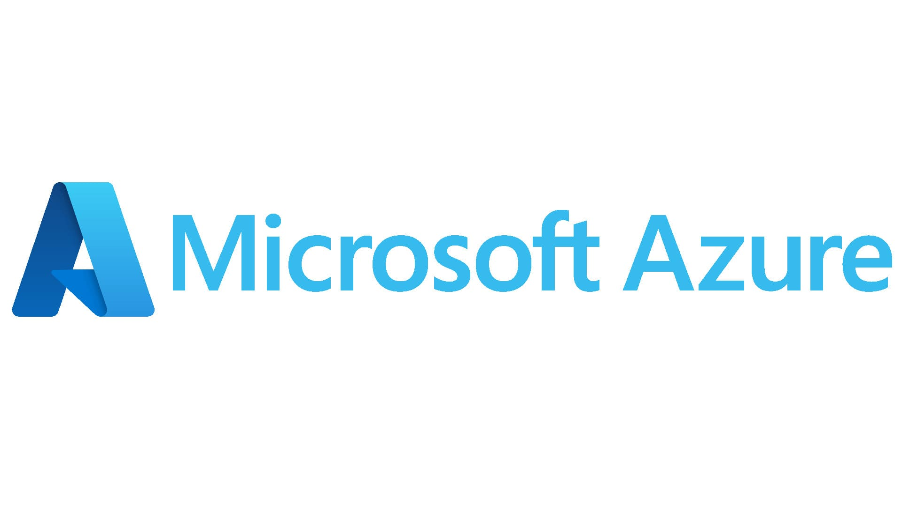
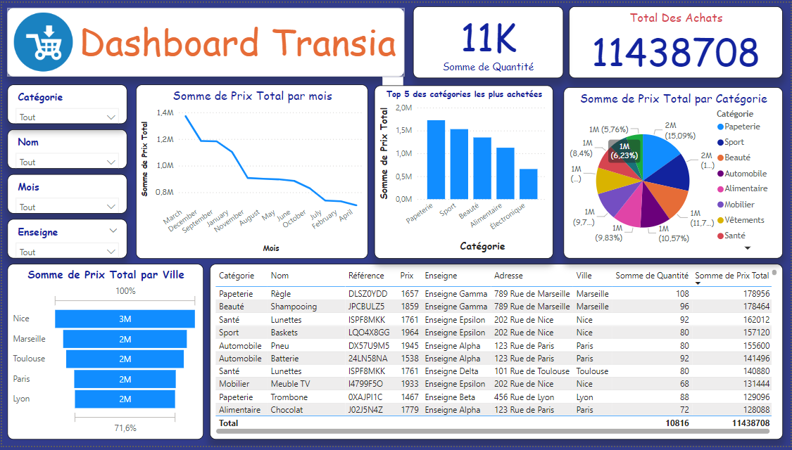
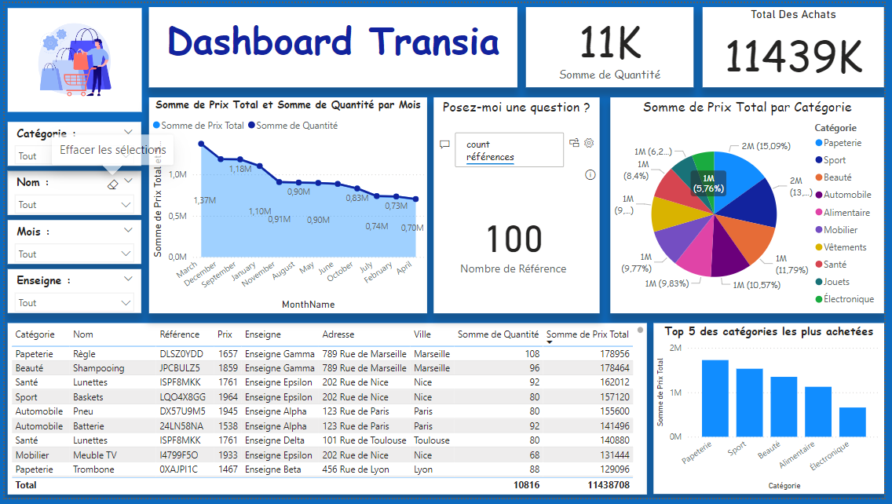
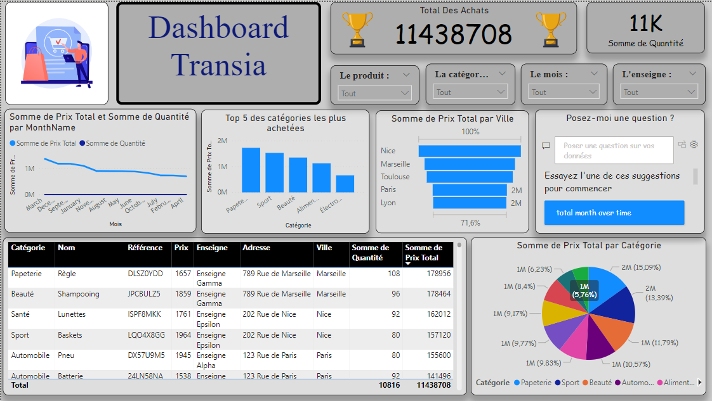

# 📊 Projet MS Azure - MS Power BI - Transia

## Description du projet

La structure Transia souhaite se doter d’un système d’information décisionnel sur le cloud Microsoft Azure afin d’analyser ses données. Pour la phase 1 du projet, elle décide de centraliser les informations d’achat dans un entrepôt de données, effectuer des analyses et permettre aux décideurs d’avoir une vision synthétique sur l’activité.

La structure Transia met à disposition 3 fichiers :

- **Enseigne** : contenant la liste des enseignes
  - Enseigne : Nom de l’enseigne
  - Ville : Ville - localisation
  - Adresse : Adresse de l’enseigne

- **Produits** : Les produits commercialisés
  - Référence : Référence du produit
  - Nom : Nom du produit
  - Catégorie : Catégorie du produit
  - Prix : Prix du produit

- **Achats** : Fichier contenant les données d’achats
  - ID Achat : Identifiant de l’achat
  - Date de l'achat : Date de l’achat
  - Référence Produit : Référence du produit
  - Quantité : Quantité commandée(s)
  - Enseigne : Enseigne ayant sollicitée la commande
  - Prix Total : Total

## Prérequis

Avant de commencer, assurez-vous d'avoir les éléments suivants installés sur votre machine :
- Microsoft azure 🌀
- Microsoft Power BI Desktop 🖥️
- Une connexion Internet 🌐

## Accès à la base de données sur MS azure

Pour accéder à la base de données utilisée dans ce projet, veuillez utiliser les informations suivantes :

- **🛠️Serveur :** ************ 
- **👤Utilisateur :** ************ 
- **🔒Mot de passe :** ************ 
- **🛢️Base de données :** ************ 

> **Note :** Veuillez vous assurer que ces informations sont conservées de manière sécurisée et ne sont pas partagées publiquement.

## Auteur(e)s

| Name               | Email                                               | LinkedIn                                                  | GitHub                                           | Kaggle                                        |
|--------------------|-----------------------------------------------------|-----------------------------------------------------------|--------------------------------------------------|-----------------------------------------------|
| **Mr MEJRI Salam** | mejri.salam@gmail.com |  |  |  |

| Name               | Email                                               | LinkedIn                                                  | GitHub                                           | Kaggle                                        |
|--------------------|-----------------------------------------------------|-----------------------------------------------------------|--------------------------------------------------|-----------------------------------------------|
| **Mme BENAMOR Nesrine**  | nesrinebenamor518@gmail.com |  |  |  |

## Dashboard

### Modèle 1️⃣

### Modèle 2️⃣

### Modèle 3️⃣

